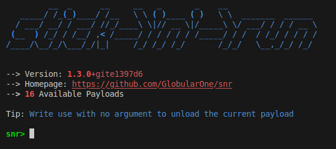

# snr

  

 

Snr (Stick 'n' Run) is a project that allows generating bootable mediums based on Debian. These bootable mediums only have one purpose. To run a payload. You can choose from the wide ranges of payloads we already offer (from changing user information to wiping disks, encrypting them, grabbing files, etc) or write your own using the framework. This allows your payload to run with absolutely no restrictions, no firewalls, no AVs, nothing.

## Features

* Beautiful and modern interface

* Wide range of existing payloads

* Running payloads in a dedicated OS allows bypassing software protection measures  

* Easily extendable with new payloads

Be sure to check the [wiki](https://snr.readthedocs.io/en/stable) for more information.

## Installation

See [Installation Guide](https://snr.readthedocs.io/en/stable/user_guide/installation.html)

## Disclaimer

This security tool is designed for lawful security testing and research purposes only.
The development team unequivocally condemns any illegal activities or unauthorized access to systems or data.
Misuse of this tool for malicious intent is strictly prohibited.
The creators and contributors of this tool shall not be held responsible for any harm,
damage, or legal repercussions resulting from its misuse by malicious actors.
Users are solely responsible for ensuring compliance with all relevant laws and regulations when utilizing this tool.
By using this tool, you agree to employ it responsibly and ethically.

## Contacting the author

You can always send an email to me. I am available as `GlobularOne@proton.me`

## License

GPLv3. See the [LICENSE](https://github.com/GlobularOne/snr/blob/main/LICENSE) file for more information.
