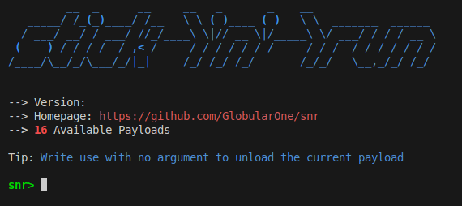
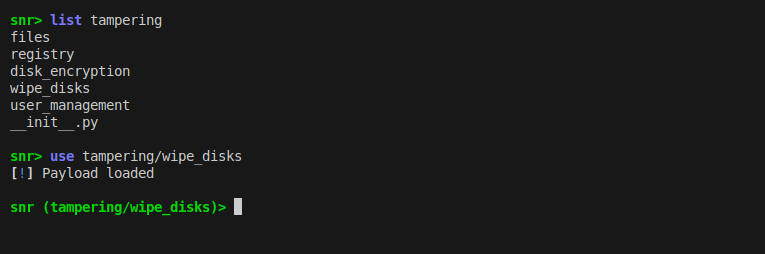
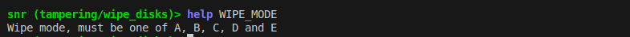

Getting Started with Snr
========================

Snr (Stick 'n' Run) is a project that allows generating bootable mediums based on Ubuntu. These bootable mediums only have one purpose. To run a payload.

The project ultimately stems from one concept, physical access can be incredibly powerful. And snr is the toolkit for that. Modern operating systems come with several software based protections, login screens, restricted admin powers, firewalls, anti-viruses and so many other, yet none work when the operating system isn't on. This is when snr comes in, it allows you to bypass all those with never starting the operating system anyway, with just boot the generated operating system and let it do all the dirty stuff for you.

**Note that this guide assumes you installed snr using pipx (no matter stable, beta).
If you installed using source code, run a shell with `poetry shell` first and then continue`**

Initialize Snr
--------------

If you have **installed the stable or beta version, this is already handled and you can skip this part**, if you installed from source code, snr needs some components to run:

.. code-block:: shell

    snr --init

Snr Basics
----------

Some basic commands to help you start quickly are (you can use help on each command or use help by itself to get a list of the commands):

* `chdir`: Change current working directory, by default snr moves over to where the payloads are.

* `list`: List all files and directories in the current working directory (or pass a directory to it to list.)

* `set`: Manage variables.

* `use`: Load a payload.

* `info`: Show information about a payload.

* `generate`: Generate a payload.

However snr includes many more commands you could use, but these should be enough to get you started. Let's show you an example, first to snr's interface:

   Snr's interface with the version removed manually.

Now to examples:

Notice how the prompt changed? This helps you remember what payload you have loaded.

.. figure:: img/3.png
   :alt: Using the command `info`

Here we use the `info` command to see more information on the payload.

Now, it seems like the payload can be configured using `WIPE_MODE` variable (you can see the list of valid values in the payload's info). Let's say we were to use mode `B`. Variables have help text as well:

Now let's just change its value:

.. figure:: img/5.png
    :alt: Changing value of `WIPE_MODE` to `B` using `set WIPE_MODE B`

Here we choose wipe mode `B`, which according to the payload's help text, overwrites the whole disk with zeros. Now we can use `generate` to generate the payload but it needs an output, it could be a file (you could use dd to write it to a disk later) or a disk directly. Here we assume we have a USB stick at `/dev/sdb`:

.. code-block::

    generate /dev/sdb

And it's done! Now you got a very dangerous USB drive (be responsible with it, as the disclaimer said.)

.. seealso::

    :doc:`faq`
        Don't forget to read the FAQ!

.. seealso::

    And some of the basics of snr.

        :doc:`deeper_introduction`

        :doc:`payload_categories`

        :doc:`shell_commands`
