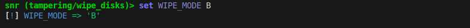

Getting Started with Snr
========================

Snr (Stick 'n' Run) is a project that allows generating bootable mediums based on Debian. These bootable mediums only have one purpose. To run a payload.

It ultimately comes down to one thing, physical access can be very very powerful. And snr is the toolkit for that. Modern operating systems come with several software based protections, login screens, restricted admin powers, firewalls, anti-viruses and so many other, yet none work when the operating system isn't on. This is when snr comes, it allows you to bypass all those with never starting the operating system but just boot the generated operating system and let it do all the dirty stuff for you.

**Note that this guide assumes you installed snr using pipx (no matter stable, beta).
If you installed using source code, run a shell with `poetry shell` first and then continue`**

Initialize snr
--------------

If you haven't already done this in the :doc:`installation`. Snr needs to download some components to run. All can be done using one command:

.. code-block:: shell

    snr --init

Agree with the disclaimer and allow snr to initialize (write yes twice). After initialization is done, you will be met with a console interface.

Snr basics
----------

Some basic commands to help you start quickly are (you can use help on each command or use help by itself to get a list of commands):

* `chdir`: Change current working directory, by default snr moves over to where the payloads are

* `list`: list all files and directories in the current working directory (or pass a directory to it to list)

* `set`: Manage variables

* `use`: load a payload

* `info`: Show information about a payload

* `generate`: Generate a payload

However snr includes a lot more commands you could use, but these should be enough to get you started. But let's show you an example, but first snr's interface:

.. figure:: img/1.png
   :alt: Snr's interface, which shows a banner, it's version (removed in the picture), snr's homepage and it's total count of available payloads.

   Snr's interface with the version removed manually.

Now to examples:

.. figure:: img/2.png
   :alt: Running command `list` and using the `tampering/wipe_disks` payload

Noticed how the prompt changed? This helps you remember what payload you have loaded.

Here we used the `info` command to see more information on the payload.

Now, it seems like it can be configured using `WIPE_MODE` variable (you can see the list of valid values in the payload's info). Let's say we were to use mode B. But not only payloads, but variables have help text as well:

.. figure:: img/4.png
   :alt: Getting the help text of variable WIPE_MODE using `help WIPE_MODE`

Now let's just change it's value:

Here we chose wipe mode B, which according to the payload's help text, it overwrites the whole disk with zeros. Now we can use `generate` to generate the payload but it needs an output, it could be a file (you could use dd to write it to a disk later) or a disk directly. Here we assume we have a USB stick at `/dev/sdb`:

.. code-block::

    generate /dev/sdb

And it's done! Now you got a very dangerous USB drive (be responsible with it, as the disclaimer said)

Don't forget to read the :doc:`faq` and know more about snr with more of it's basics:

* :doc:`deeper_introduction`
* :doc:`payload_categories`
* :doc:`shell_commands`
